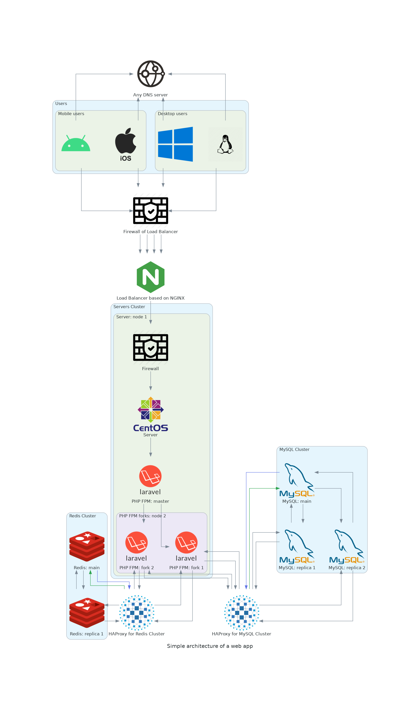
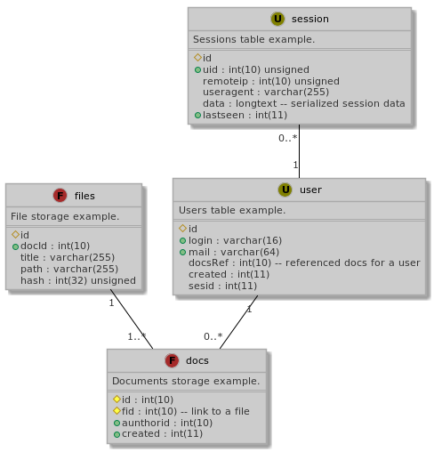

# Полезные диаграммы

## Как создаётся веб-сайт


## Архитектура high availability сайта



### PostgreSQL схема



- Генерация SQL-схемы:
 
```
python3 tools/plantuml2mysql.py src/db_schema.puml sampledb
```
